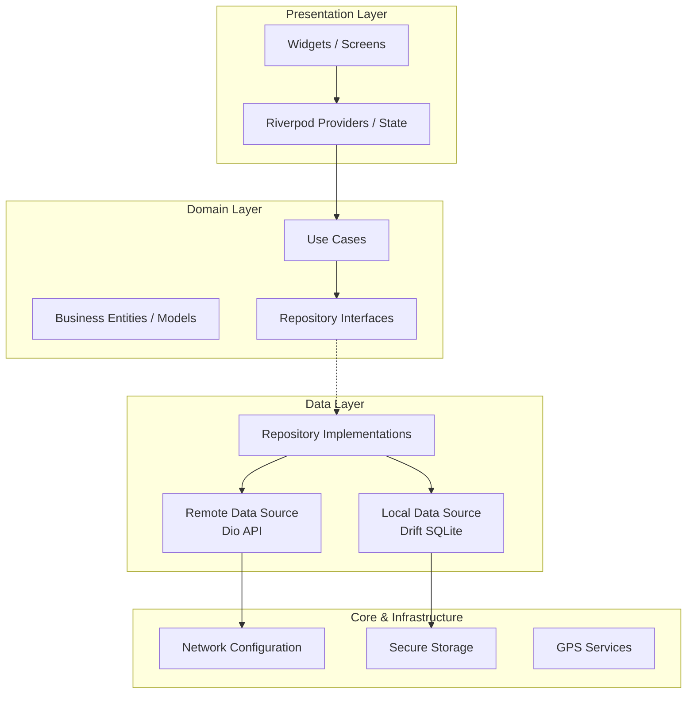

# Clean Architecture

```mermaid
graph TD
    subgraph Presentation Layer
        UI[Widgets / Screens]
        State[Riverpod Providers / State]
    end
    
    subgraph Domain Layer
        Entities[Business Entities / Models]
        UseCases[Use Cases]
        RepoInterfaces[Repository Interfaces]
    end
    
    subgraph Data Layer
        RepoImpl[Repository Implementations]
        RemoteDS[Remote Data Source<br/>Dio API]
        LocalDS[Local Data Source<br/>Drift SQLite]
    end
    
    subgraph Core & Infrastructure
        Network[Network Configuration]
        StorageInfra[Secure Storage]
        Location[GPS Services]
    end
    
    UI --> State
    State --> UseCases
    UseCases --> RepoInterfaces
    RepoInterfaces -.-> RepoImpl
    RepoImpl --> RemoteDS
    RepoImpl --> LocalDS
    
    RemoteDS --> Network
    LocalDS --> StorageInfra
```
