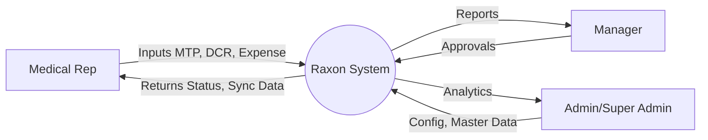
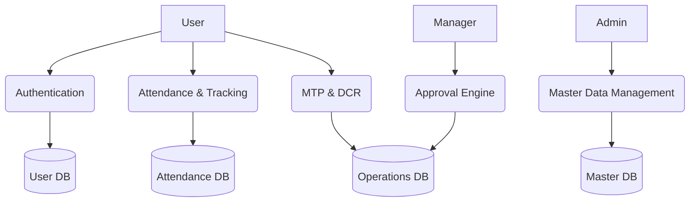
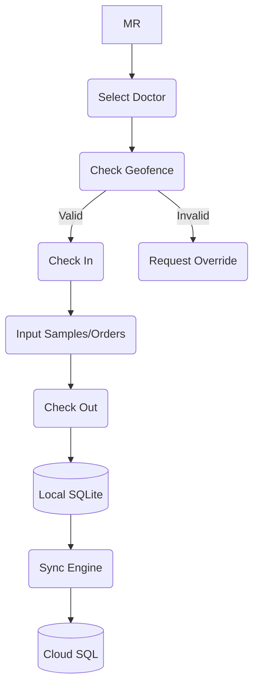

# Data Flow Diagrams (DFD)

## DFD Level 0 (Context Diagram)

```mermaid
graph LR
    MR[Medical Rep] -->|Inputs MTP, DCR, Expense| System((Raxon System))
    System -->|Returns Status, Sync Data| MR
    Manager[Manager] -->|Approvals| System
    System -->|Reports| Manager
    Admin[Admin/Super Admin] -->|Config, Master Data| System
    System -->|Analytics| Admin
```

## DFD Level 1

```mermaid
graph TD
    User[User] --> P1(Authentication)
    P1 --> DB[(User DB)]
    
    User --> P2(Attendance & Tracking)
    P2 --> DB2[(Attendance DB)]
    
    User --> P3(MTP & DCR)
    P3 --> DB3[(Operations DB)]
    
    Manager[Manager] --> P4(Approval Engine)
    P4 --> DB3
    
    Admin[Admin] --> P5(Master Data Management)
    P5 --> DB4[(Master DB)]
```

## DFD Level 2 (DCR Process)

```mermaid
graph TD
    MR[MR] --> C1(Select Doctor)
    C1 --> C2(Check Geofence)
    C2 -->|Valid| C3(Check In)
    C2 -->|Invalid| C4(Request Override)
    C3 --> C5(Input Samples/Orders)
    C5 --> C6(Check Out)
    C6 --> DB[(Local SQLite)]
    DB --> Sync(Sync Engine)
    Sync --> Remote[(Cloud SQL)]
```
