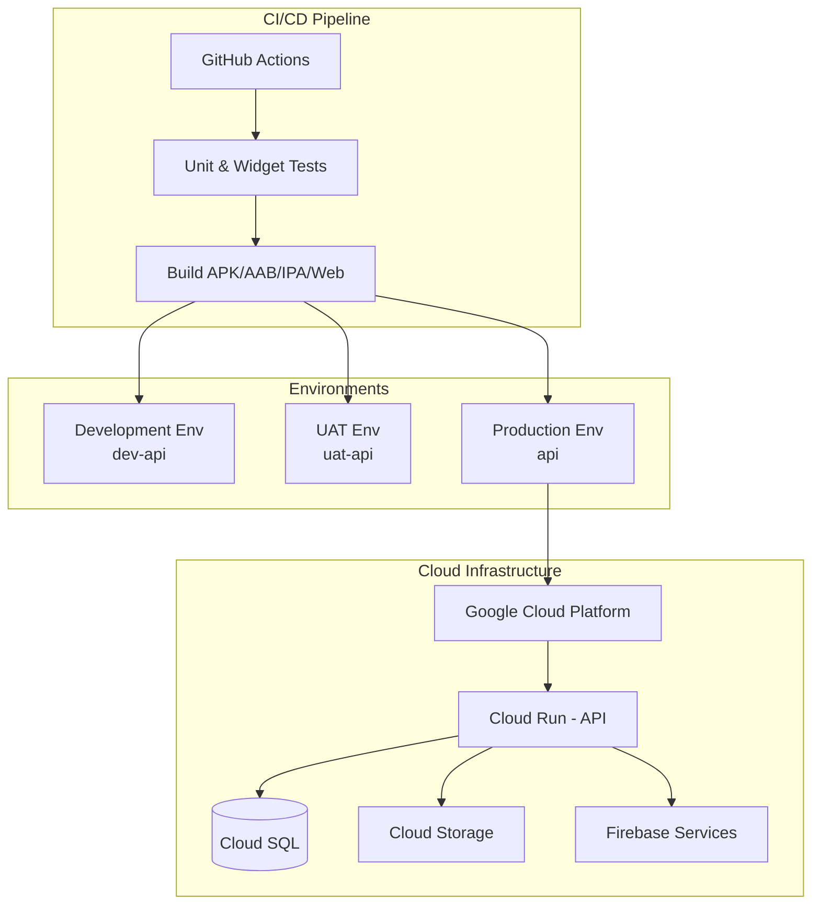

# Deployment Architecture

```mermaid
graph TD
    subgraph CI/CD Pipeline
        GitHub[GitHub Actions]
        Test[Unit & Widget Tests]
        Build[Build APK/AAB/IPA/Web]
    end
    
    subgraph Environments
        DEV[Development Env<br/>dev-api]
        UAT[UAT Env<br/>uat-api]
        PROD[Production Env<br/>api]
    end
    
    subgraph Cloud Infrastructure
        GCP[Google Cloud Platform]
        CloudRun[Cloud Run - API]
        CloudSQL[(Cloud SQL)]
        Storage[Cloud Storage]
        Firebase[Firebase Services]
    end
    
    GitHub --> Test
    Test --> Build
    Build --> DEV
    Build --> UAT
    Build --> PROD
    
    PROD --> GCP
    GCP --> CloudRun
    CloudRun --> CloudSQL
    CloudRun --> Storage
    CloudRun --> Firebase
```
