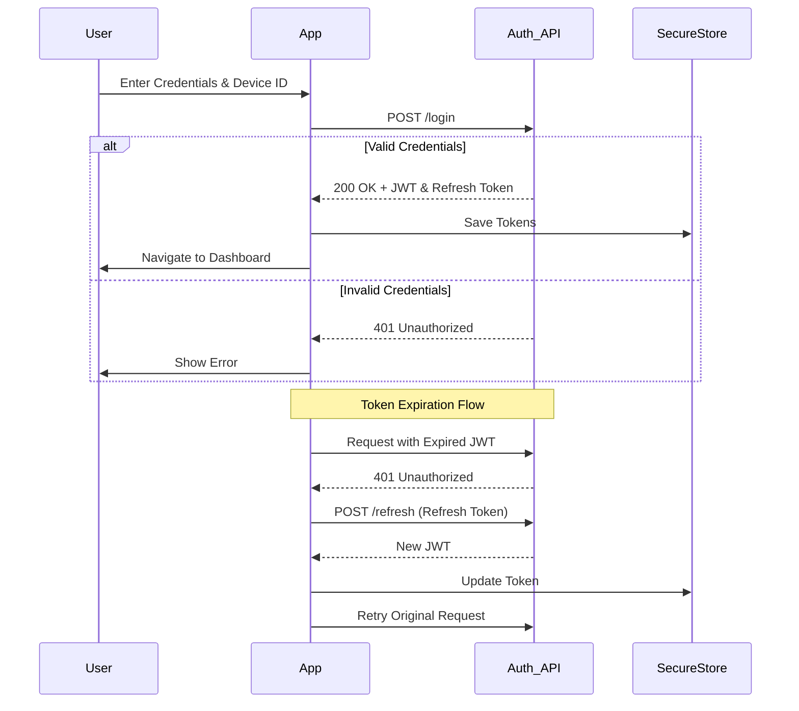
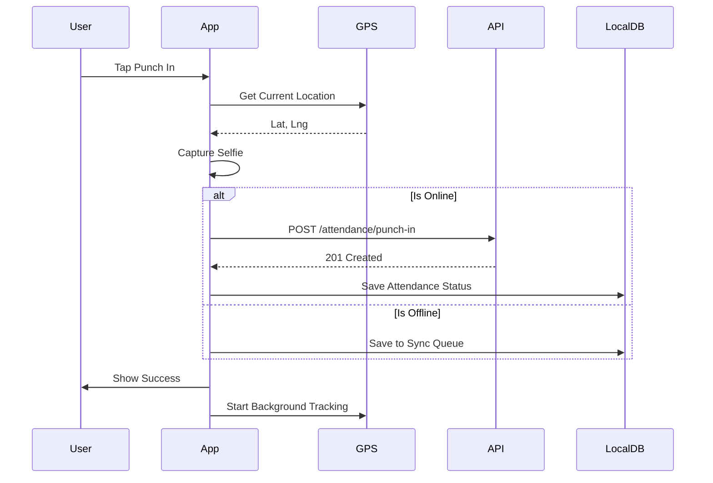
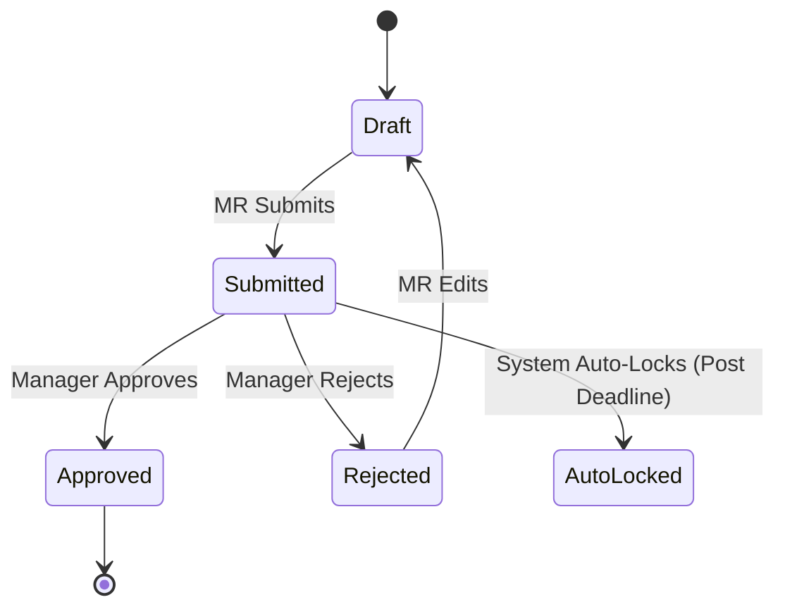
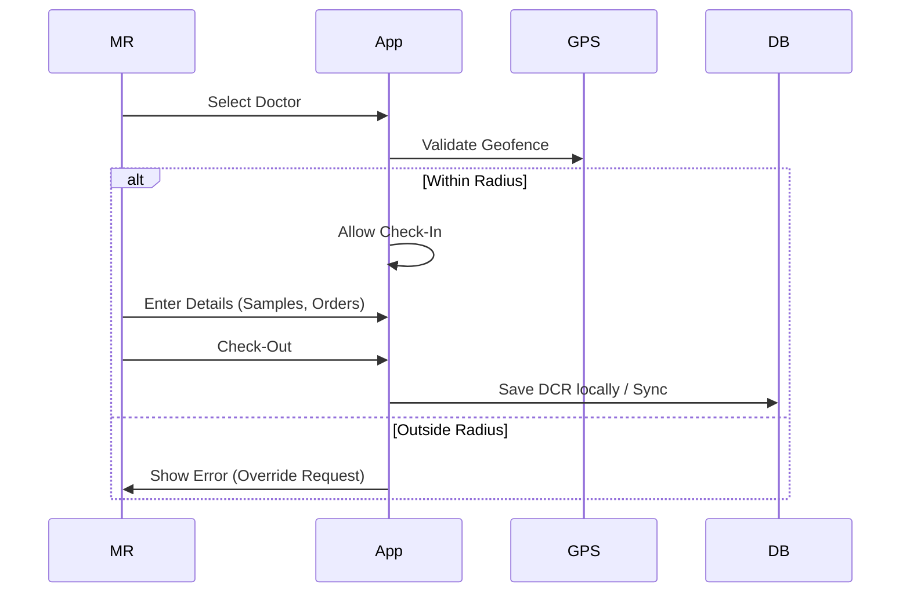
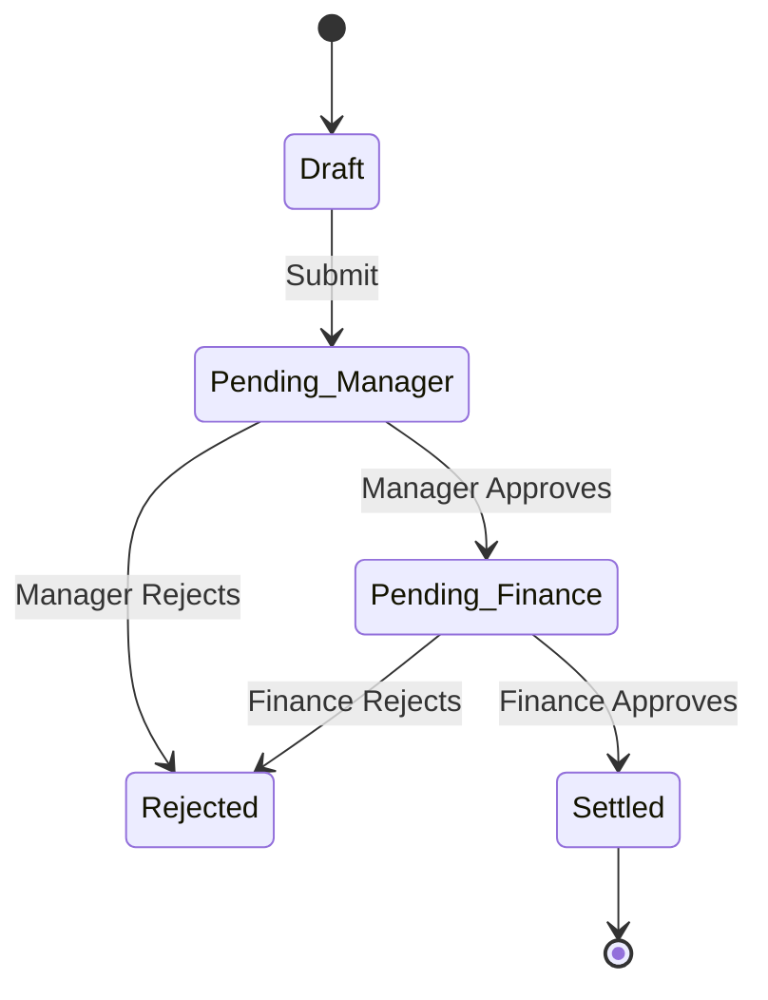
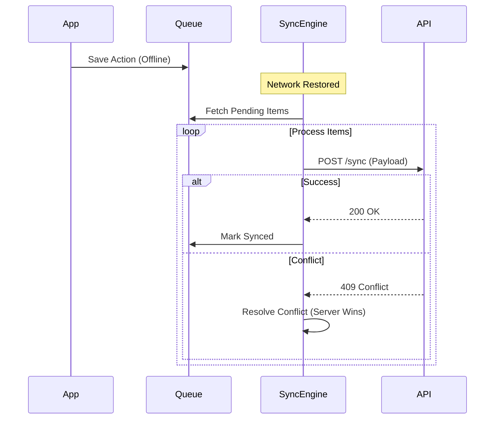
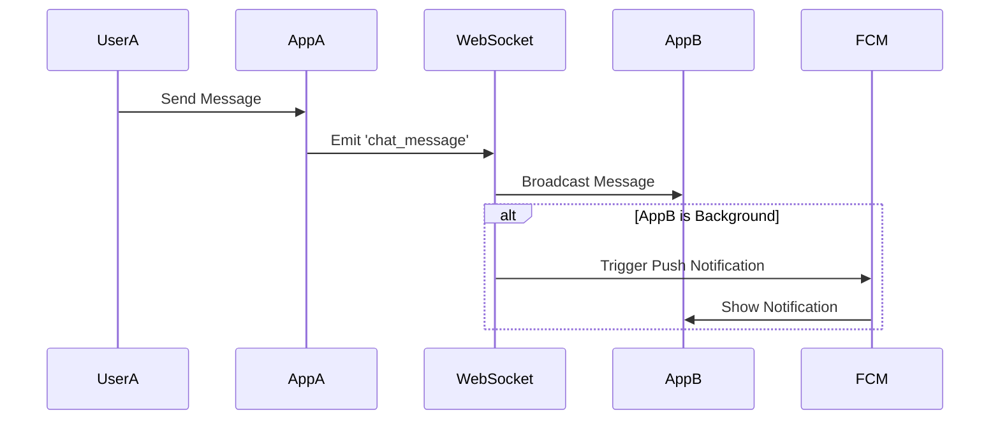

# Flow Diagrams

## Authentication Flow (Login & Refresh)

```mermaid
sequenceDiagram
    participant User
    participant App
    participant Auth_API
    participant SecureStore
    
    User->>App: Enter Credentials & Device ID
    App->>Auth_API: POST /login
    alt Valid Credentials
        Auth_API-->>App: 200 OK + JWT & Refresh Token
        App->>SecureStore: Save Tokens
        App->>User: Navigate to Dashboard
    else Invalid Credentials
        Auth_API-->>App: 401 Unauthorized
        App->>User: Show Error
    end
    
    Note over App, Auth_API: Token Expiration Flow
    App->>Auth_API: Request with Expired JWT
    Auth_API-->>App: 401 Unauthorized
    App->>Auth_API: POST /refresh (Refresh Token)
    Auth_API-->>App: New JWT
    App->>SecureStore: Update Token
    App->>Auth_API: Retry Original Request
```

## Attendance Flow

```mermaid
sequenceDiagram
    participant User
    participant App
    participant GPS
    participant API
    participant LocalDB
    
    User->>App: Tap Punch In
    App->>GPS: Get Current Location
    GPS-->>App: Lat, Lng
    App->>App: Capture Selfie
    alt Is Online
        App->>API: POST /attendance/punch-in
        API-->>App: 201 Created
        App->>LocalDB: Save Attendance Status
    else Is Offline
        App->>LocalDB: Save to Sync Queue
    end
    App->>User: Show Success
    App->>GPS: Start Background Tracking
```

## MTP Flow

```mermaid
stateDiagram-v2
    [*] --> Draft
    Draft --> Submitted : MR Submits
    Submitted --> Approved : Manager Approves
    Submitted --> Rejected : Manager Rejects
    Rejected --> Draft : MR Edits
    Submitted --> AutoLocked : System Auto-Locks (Post Deadline)
    Approved --> [*]
```

## DCR Flow

```mermaid
sequenceDiagram
    participant MR
    participant App
    participant GPS
    participant DB
    
    MR->>App: Select Doctor
    App->>GPS: Validate Geofence
    alt Within Radius
        App->>App: Allow Check-In
        MR->>App: Enter Details (Samples, Orders)
        MR->>App: Check-Out
        App->>DB: Save DCR locally / Sync
    else Outside Radius
        App->>MR: Show Error (Override Request)
    end
```

## Expense Flow

```mermaid
stateDiagram-v2
    [*] --> Draft
    Draft --> Pending_Manager : Submit
    Pending_Manager --> Pending_Finance : Manager Approves
    Pending_Manager --> Rejected : Manager Rejects
    Pending_Finance --> Settled : Finance Approves
    Pending_Finance --> Rejected : Finance Rejects
    Settled --> [*]
```

## Offline Sync Flow

```mermaid
sequenceDiagram
    participant App
    participant Queue
    participant SyncEngine
    participant API
    
    App->>Queue: Save Action (Offline)
    Note over SyncEngine: Network Restored
    SyncEngine->>Queue: Fetch Pending Items
    loop Process Items
        SyncEngine->>API: POST /sync (Payload)
        alt Success
            API-->>SyncEngine: 200 OK
            SyncEngine->>Queue: Mark Synced
        else Conflict
            API-->>SyncEngine: 409 Conflict
            SyncEngine->>SyncEngine: Resolve Conflict (Server Wins)
        end
    end
```

## Chat & Notification Flow

```mermaid
sequenceDiagram
    participant UserA
    participant AppA
    participant WebSocket
    participant AppB
    participant FCM
    
    UserA->>AppA: Send Message
    AppA->>WebSocket: Emit 'chat_message'
    WebSocket->>AppB: Broadcast Message
    alt AppB is Background
        WebSocket->>FCM: Trigger Push Notification
        FCM->>AppB: Show Notification
    end
```
