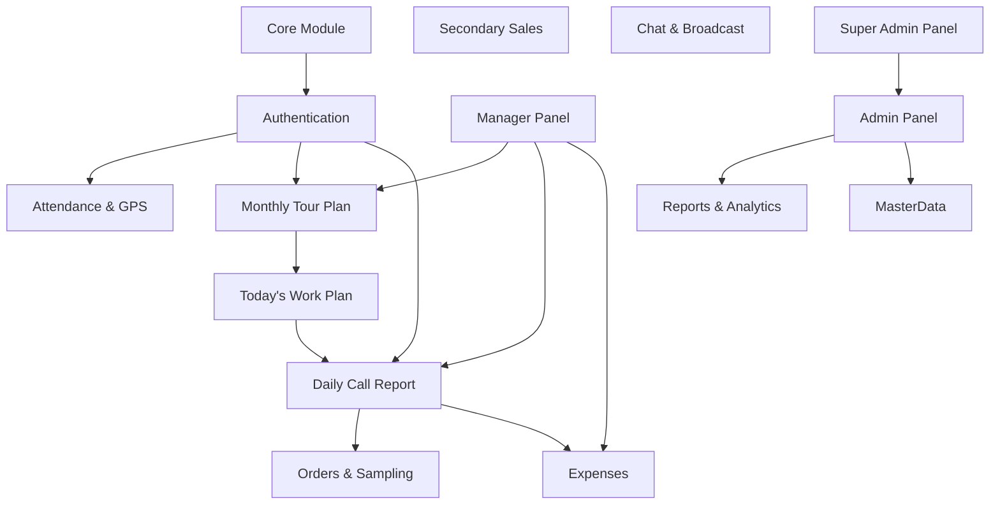

# Module Architecture

```mermaid
graph TD
    Core[Core Module]
    
    Auth[Authentication]
    Attendance[Attendance & GPS]
    MTP[Monthly Tour Plan]
    WorkPlan[Today's Work Plan]
    DCR[Daily Call Report]
    Orders[Orders & Sampling]
    Expenses[Expenses]
    SecondarySales[Secondary Sales]
    Chat[Chat & Broadcast]
    
    Manager[Manager Panel]
    Admin[Admin Panel]
    SuperAdmin[Super Admin Panel]
    Reports[Reports & Analytics]
    
    Core --> Auth
    Auth --> Attendance
    Auth --> MTP
    Auth --> DCR
    
    DCR --> Orders
    DCR --> Expenses
    
    MTP --> WorkPlan
    WorkPlan --> DCR
    
    Manager --> MTP
    Manager --> DCR
    Manager --> Expenses
    
    Admin --> Reports
    Admin --> MasterData
    
    SuperAdmin --> Admin
```
