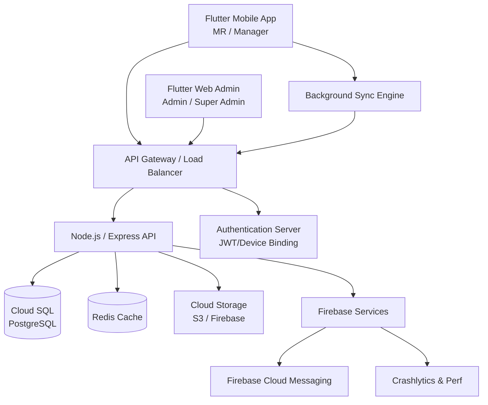

# System Architecture

```mermaid
graph TD
    Client_Mobile[Flutter Mobile App<br/>MR / Manager]
    Client_Web[Flutter Web Admin<br/>Admin / Super Admin]
    
    API_Gateway[API Gateway / Load Balancer]
    
    Backend[Node.js / Express API]
    Auth_Server[Authentication Server<br/>JWT/Device Binding]
    Sync_Engine[Background Sync Engine]
    
    DB[(Cloud SQL<br/>PostgreSQL)]
    Cache[(Redis Cache)]
    Storage[Cloud Storage<br/>S3 / Firebase]
    
    Firebase[Firebase Services]
    FCM[Firebase Cloud Messaging]
    Crashlytics[Crashlytics & Perf]
    
    Client_Mobile --> API_Gateway
    Client_Web --> API_Gateway
    
    API_Gateway --> Backend
    API_Gateway --> Auth_Server
    
    Backend --> DB
    Backend --> Cache
    Backend --> Storage
    
    Backend --> Firebase
    Firebase --> FCM
    Firebase --> Crashlytics
    
    Client_Mobile --> Sync_Engine
    Sync_Engine --> API_Gateway
```
