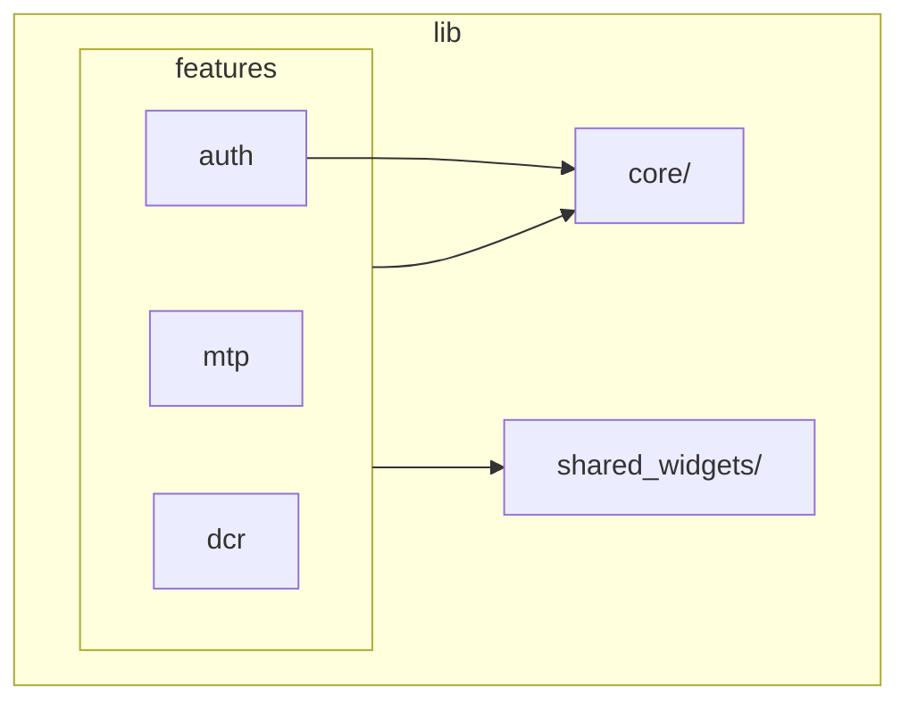
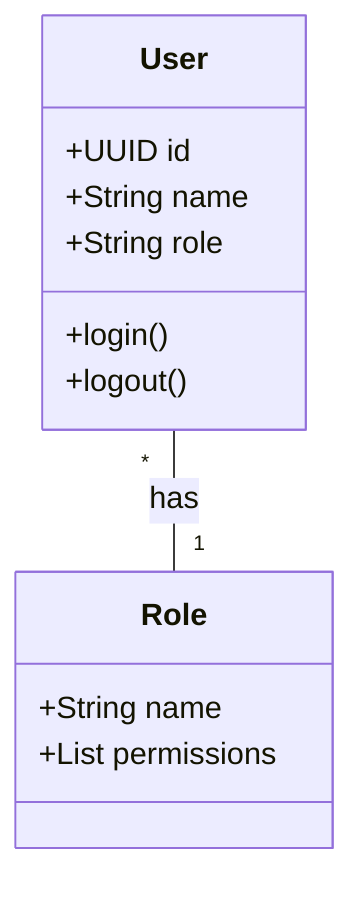

# UML Diagrams

## 1. Component Diagram
```mermaid
componentDiagram
    component [Flutter UI] as UI
    component [Riverpod State] as State
    component [Repositories] as Repos
    component [Dio Network Client] as Net
    component [Drift SQLite] as DB
    
    UI --> State
    State --> Repos
    Repos --> Net
    Repos --> DB
```

## 2. Package Diagram


## 3. Class Diagram (Partial)

*(Other diagrams such as Sequence and Activity are covered in FLOW_DIAGRAMS.md)*
