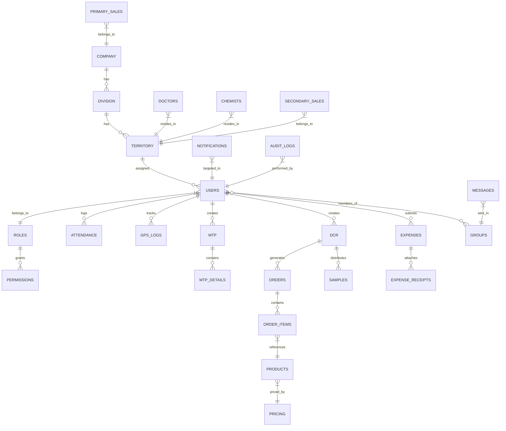

# Entity Relationship Diagram

```mermaid
erDiagram
    COMPANY ||--o{ DIVISION : has
    DIVISION ||--o{ TERRITORY : has
    TERRITORY ||--o{ USERS : assigned
    USERS }|--|| ROLES : belongs_to
    ROLES ||--o{ PERMISSIONS : grants
    USERS ||--o{ ATTENDANCE : logs
    USERS ||--o{ GPS_LOGS : tracks
    USERS ||--o{ MTP : creates
    MTP ||--o{ MTP_DETAILS : contains
    USERS ||--o{ DCR : creates
    DCR ||--o{ ORDERS : generates
    DCR ||--o{ SAMPLES : distributes
    USERS ||--o{ EXPENSES : submits
    EXPENSES ||--o{ EXPENSE_RECEIPTS : attaches
    DOCTORS }|--|| TERRITORY : resides_in
    CHEMISTS }|--|| TERRITORY : resides_in
    ORDERS ||--o{ ORDER_ITEMS : contains
    ORDER_ITEMS }|--|| PRODUCTS : references
    PRODUCTS }|--|| PRICING : priced_by
    PRIMARY_SALES }|--|| COMPANY : belongs_to
    SECONDARY_SALES }|--|| TERRITORY : belongs_to
    MESSAGES }|--|| GROUPS : sent_in
    USERS }o--o{ GROUPS : members_of
    NOTIFICATIONS }|--|| USERS : targeted_to
    AUDIT_LOGS }|--|| USERS : performed_by
```
